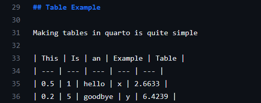
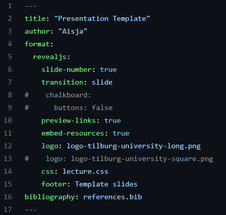

# Quarto Templates

Quarto is a markdown-type language that can be used to make (among others) presentations and reports. More on Quarto and how to install it can be found [here](https://quarto.org/docs/get-started/). 

This template makes it easier to include code and functions in your presentations via markdown. The code is integrated into the slides and you can directly show both the code and it's output on the slides. Quarto allows you to generate html presentations, PowerPoint presentations, or pdf presentations from the same quarto file (this template is optimized for an html presentation using revealJS). This standardized template also ensures you do not have to bother with the formatting every time you need to make a new presentation in a different format. 

## Contents of the template
The template is made to create presentations in html using quarto for Tilburg University presentations. The templates contains information on how to format the slides and how to insert things like tables and figures.




## How to use this template
This template can be used to create presentations with standard formatting and the Tilburg University logo included. To use this template in a new presentation simply run the following line in the command prompt:
```
quarto use template tilburgsciencehub/quarto_presentation_template
```
This will ask you to specify the name of the folder you want the new presentation to be created in. The name of template.qmd will also be changed to this new name.

The easiest way to edit the content of the template is by opening the qmd file in *RStudio* or *Visual Studio Code* here all contents can be changed as preferred.

## Customization
You can edit all the content of the template below the yaml specification. Within this specification, you can change the title, author, footer and the name of the .bib file if necessary. You can also choose to use an alternative form of the Tilburg university logo by uncommenting the second logo line and commenting the first one.



## Work in progress
More functionalities will be added as examples to this template in the future


